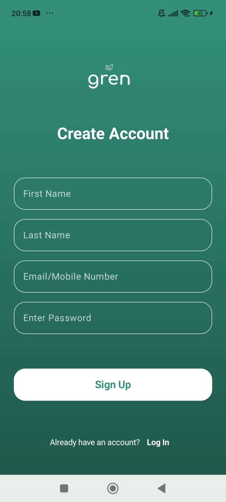
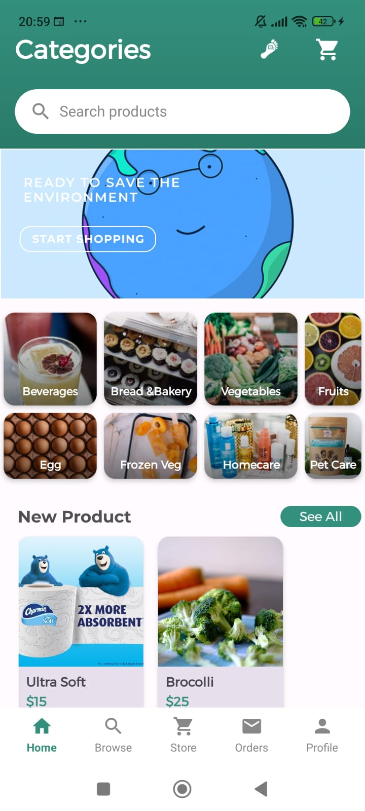
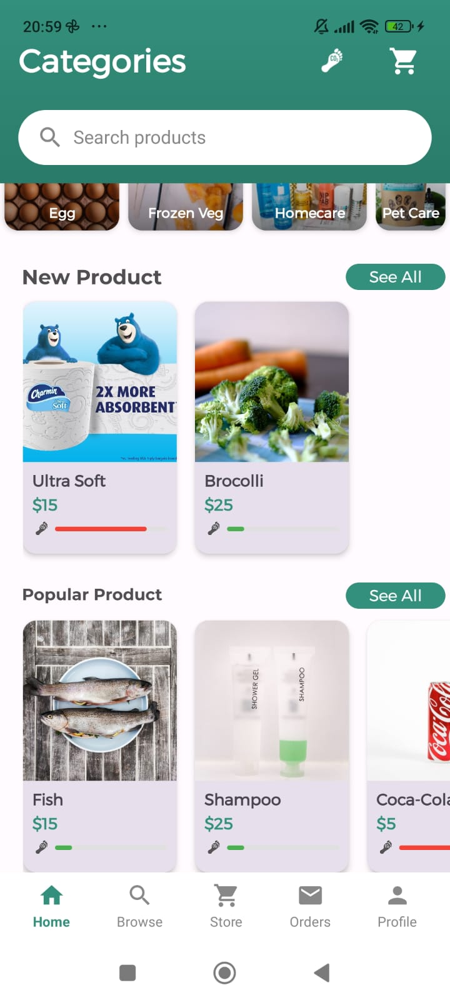
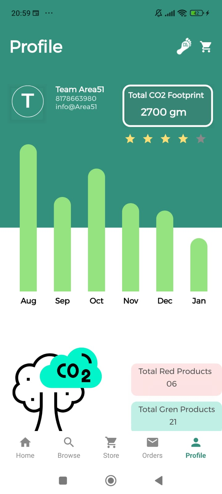
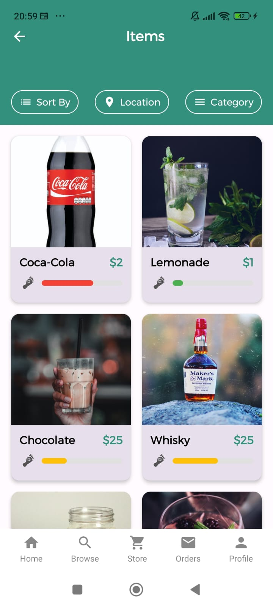

# Gren 🌿
**Promoting Sustainable Habits to Reduce Environmental Impact**

Gren is a android E-Commerce application designed to encourage sustainable living by helping users identify recyclable items, track sustainable habits, and reduce their environmental footprint. It integrates AI-powered image recognition, Firebase for storage, and real-time data to make it easy for users to contribute to a greener future.

## Features 📱
- **Image Recognition for Recyclables**:  
  Upload images and let Gren's AI-powered system identify whether the items are recyclable or not. This feature is powered by Eden AI.

- **Habit Tracking**:  
  Track your daily sustainable activities such as recycling, reducing waste, and conserving energy, and monitor your environmental impact.

- **Data Storage with Firebase**:  
  Users' images and personal data are securely stored and managed with Firebase.

- **Sustainable Living Insights**:  
  Get insights and tips on how to adopt more sustainable habits in everyday life.

## Technology Stack 🛠
- **Frontend**:  
  Built with Kotlin and Jetpack Compose, following modern Android development practices for a sleek and responsive UI.

- **Backend**:  
  Firebase for authentication, storage, and database management.

- **AI Integration**:  
  Utilizes Eden AI's API for image recognition to detect and classify recyclable items.

- **API**:  
  Retrofit is used for making API calls and processing responses.

## App Screenshots 📸
Here are some screenshots of the Gren app in action:

 &nbsp;  &nbsp;  &nbsp;  &nbsp;  &nbsp;  &nbsp;  &nbsp;  &nbsp;  &nbsp;  &nbsp; 


## Getting Started 🚀
To get a local copy of Gren up and running, follow these steps:

### Prerequisites
- Android Studio (Latest Version)
- A Firebase account with a project set up for authentication and storage.
- API keys for Eden AI.

### Installation
1. **Clone the Repository**:
   ```bash
   git clone https://github.com/Deepak-10439/Gren-Usar.git
   ```
2. **Open in Android Studio**:
   Open the project in Android Studio.

3. **Configure Firebase**:
    - Add the `google-services.json` file to the `app` directory after setting up Firebase authentication and storage.

4. **Eden AI API Setup**:
    - Register on Eden AI and get the API key. Configure it in your app to enable image recognition.

5. **Build and Run**:
    - Sync Gradle, build the app, and run it on an emulator or physical device.

## Usage 📝
1. **Sign in** using your email and password via Firebase Authentication.
2. **Upload Images** of items to check if they are recyclable.
3. **Get personalized insights** based on your activities and improve your sustainable living.


## API Integration 🔗
- **Image Recognition**:  
  Eden AI is used for analyzing the uploaded images and classifying recyclable items.

- **Data Storage**:  
  Firebase is used for storing user data, images, and managing authentication securely.
